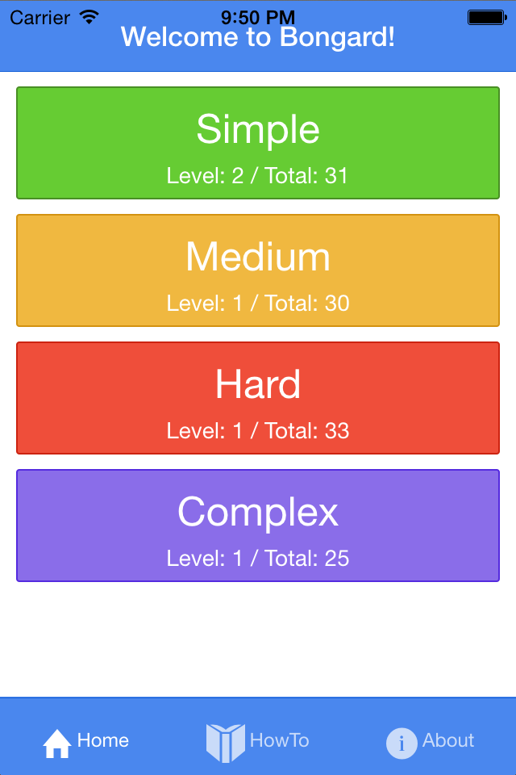
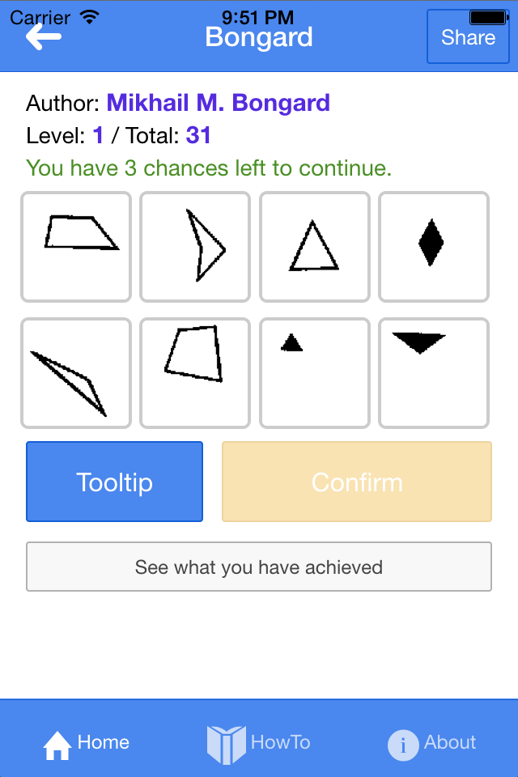
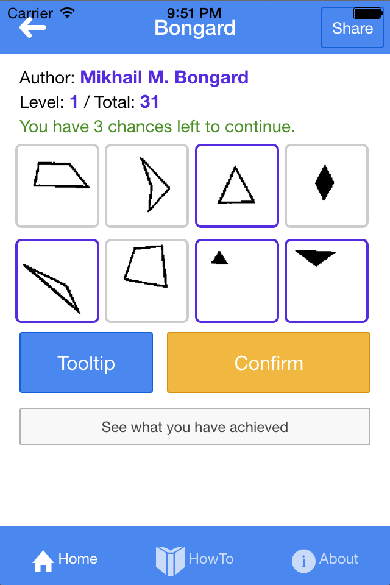

# Bongard Problems Game
A Bongard problem is a kind of puzzle invented by the computer scientist Mikhail Moiseevich Bongard in the mid-1960s. This Bongard game is come from Bongard Problems.

    
  
  
  

Demo: [http://bongard.iamsk.info/play/][1]

## Code structure and how to build this app on mobile phone
[Data prepare part][2]
[How to build this on iOS][3]

## Refs:
[Research on the Bongard Problems][4]
[Index of Bongard Problems][5]
[Design your own Bongard problems!][6]
[Things not allowed in Bongard Problems][7]
[Bongard problem][8]
[45 道 Bongard 问题：寻找图形分类的依据][9]
[Bongard problems][10]
[zendo][11]
[alvarogonzalezsotillo/Bongard][12]

[1]:	http://bongard.iamsk.info/play/
[2]:	server/README.md
[3]:	src/client/README.md
[4]:	http://www.foundalis.com/res/diss_research.html
[5]:	http://www.foundalis.com/res/bps/bpidx.htm
[6]:	http://www.foundalis.com/res/designBP.html
[7]:	http://www.foundalis.com/res/invalBP.html
[8]:	http://en.wikipedia.org/wiki/Bongard_problem
[9]:	http://www.matrix67.com/blog/archives/6124
[10]:	http://lkozma.net/blog/bongard-problems/
[11]:	http://en.wikipedia.org/wiki/Zendo_%5C(game%5C)
[12]:	https://github.com/alvarogonzalezsotillo/Bongard